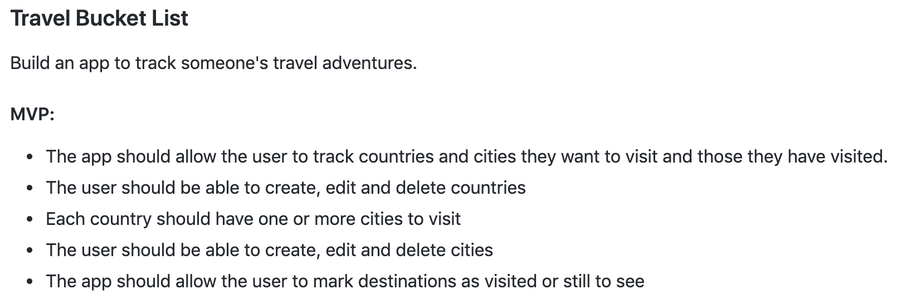

# Travel_Bucket_List
First project made at CodeClan - CodeClan Week 5

This is the first project I made at codeclan in week 5. The project was designed to consolidate our knowledge of Ruby and Sinatra.

Given 5 days, I was tasked with creating a simple web app so that people could create a travel bucketlist where they could
create destinations to visit and save them to a database. The users would also be able to view all the destinations they have visited and those they had yet to visit.



## Project Setup

Create the database

  ```createdb bucket_list```
  
Create the tables for the database

  ```psql -d bucket_list -f db/bucket_list.sql```
  
Populate the database

  ```ruby db/seeds.db```

Run app

  ```ruby app.rb```
